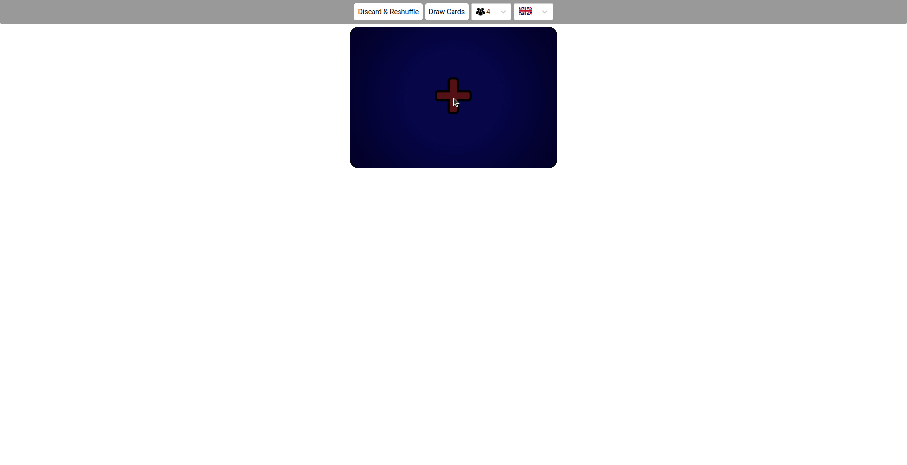
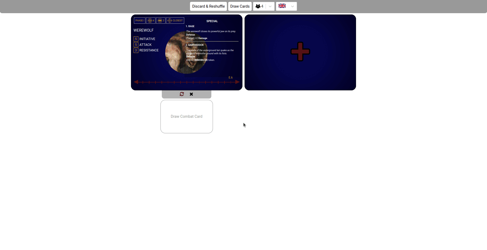
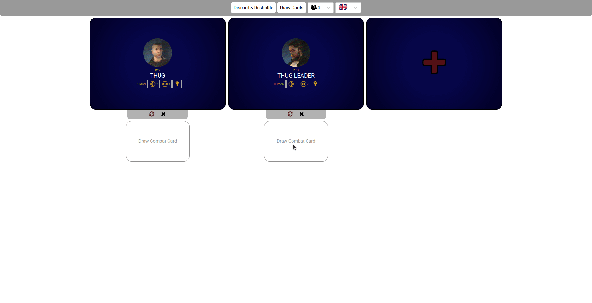
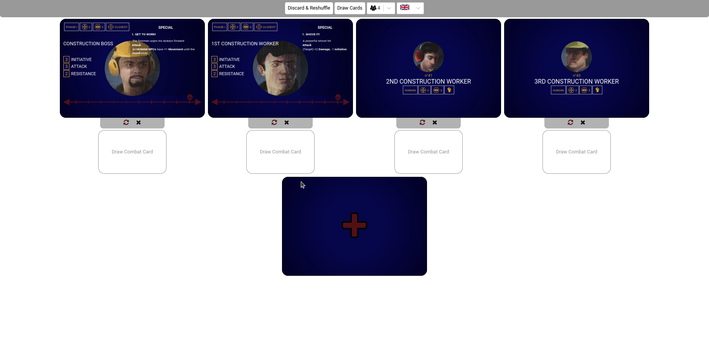

# Vampire: The Masquerade - CHAPTERS Companion App

## Description

This is a robust companion app for Vampire: the Masquerade - CHAPTERS boardgame. It contains all enemies' and allies' cards and corresponding combat decks for them.

Features:

- set up character cards

- track down their wounds

- draw their combat cards

In case of problems with readability, utilize browser zoom functionality

Supported languages:

- English
- French (thanks to [orionaskatu](https://github.com/orionaskatu))

I'll gladly accept translation strings for other languages (check out `src/translations/en.json` file)

## Further development

I have only a few vague ideas for future work on this app.

1. More detailed deck management (allowing to reshuffle decks manually, add/remove specific cards etc.). I would like to double-check if it is needed
2. UI and codebase revisit. I've made a lot of weird decisions on both fronts, so I think I need to improve them at some point. Also, maybe better mobile support
3. Scenario setup - give the ability to select a scenario and the app should set up all cards automatically.
4. Afflictions tracker - give the option to add affliction tokens to characters
5. Any other further suggestions

## Builds

I am not planning on hosting this app anywhere (at least for now). Feel free to do it on your own, maybe on a local server. With every release, I'll provide a zip file with a build that can be simply executed with a browser. Alternatively, you can clone the repo locally and create those builds on your own, or run a dev server with the application.

### Run build

A zip file should contain an `index.html`. Just run it with your browser

### Create your own build

1. Make sure you have `node` installed
2. Run `npm i` (or any other package manager like `pnpm` or `yarn`)
3. Run `npm run buildLocal`

## Background

Feel free to clone, fork, reuse or contribute. I may have less time in the next couple of weeks.

This project was bootstrapped with [Create React App](https://github.com/facebook/create-react-app).
